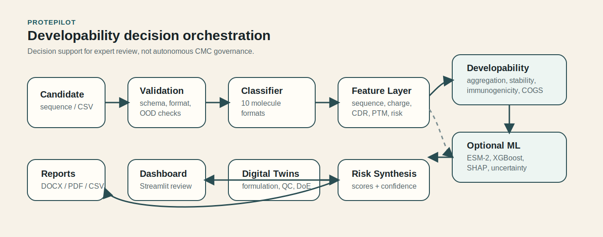
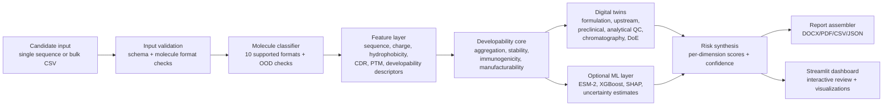

# ProtePilot Deployment Architecture

Status: deployment case-study artifact; local and containerized operation are supported by the repository, but this document is not a claim of production GxP deployment.  
Purpose: make the system architecture, run modes, validation boundaries, and failure modes clear.

## What ProtePilot solves

ProtePilot turns therapeutic-protein candidate inputs into a structured developability risk report. It is designed for early triage, not final program governance. The system connects molecule-format classification, biophysical feature extraction, digital-twin modules, optional ML predictors, and report generation into a scientist-facing workflow.

## Architecture overview





## Run modes

| Mode | Entry point | Dependencies | Best use |
|---|---|---|---|
| Core/headless | `python3 SelfTest/run_validation.py` | `requirements-core.txt` | Fast validation, report generation, CI smoke checks |
| Analysis UI | `streamlit run app.py` | `requirements-analysis.txt` | Scientist-facing workflow review |
| Training/ML | training scripts and ML modules | `requirements-training.txt` | ESM-2/XGBoost/SHAP experiments and model refresh |
| Container | `docker compose up` or Dockerfile flow | Docker | Reproducible local demo and deployment walkthrough |

## Deployment boundaries

ProtePilot is suitable for:

- candidate triage and developability-risk exploration;
- reproducible local demos;
- local scientist-facing workflow review;
- benchmark-backed discussion of model quality and limitations;
- generating structured reports for human review.

ProtePilot is not currently suitable for:

- autonomous go/no-go decisions without expert review;
- regulated GxP production use;
- replacing analytical assays or CMC governance;
- making claims about clinical success;
- storing confidential program data without additional security review.

## Validation and quality signals

Current repo-level evidence:

- 138 quality-gate checks reported as passing.
- 524+ pytest checks reported in the project README.
- 10 supported molecule formats.
- PROPHET-Ab benchmark signal across 246 antibodies.
- Graceful degradation across optional dependency layers.

Recommended deployment acceptance checks:

```bash
pip install -r requirements-core.txt
python3 SelfTest/run_validation.py
python run_all_checks.py --fast
```

For the Streamlit demo:

```bash
pip install -r requirements-analysis.txt
streamlit run app.py
```

## Failure modes to disclose

| Failure mode | Impact | Mitigation |
|---|---|---|
| Missing optional ML dependencies | ML models unavailable | Graceful fallback to calibrated heuristic scoring; dependency status check |
| Out-of-distribution molecule format | Misleading report risk | Molecule classifier and OOD flags; require human review |
| Low-quality or malformed sequence input | Invalid feature extraction | Input validation and schema checks |
| Heuristic predictor used where trained ML is expected | Overconfidence risk | Report mode/dependency state; disclose whether ML layer is active |
| Benchmark/domain mismatch | Poor generalization | Include benchmark scope and known limitations in reports |
| LLM copilot hallucination | Unsupported scientific claim | Treat LLM as optional interface only; deterministic tools and report artifacts remain source of truth |

## Demo Script

1. Open with the problem: early biologics candidate triage is fragmented across assays, heuristics, and expert judgment.
2. Show input: candidate sequence or bulk CSV across supported molecule formats.
3. Show routing: classifier, feature layer, developability core, optional ML, digital twins.
4. Show output: risk report with per-dimension confidence and visualizations.
5. Show validation: quality gates, tests, PROPHET-Ab benchmark, and limitations.
6. Close with deployment boundary: decision support for expert review, not autonomous CMC governance.

## Next hardening tasks

- Add a minimal CI workflow that runs the fast quality gate on every push.
- Add a small demo dataset with expected output snapshots.
- Add an LLM/tool-calling wrapper that calls deterministic ProtePilot functions and cites generated report sections.
- Add a public deployment walkthrough with screenshots and a known-limitations section.
